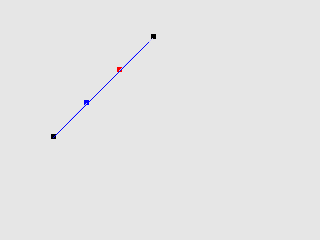
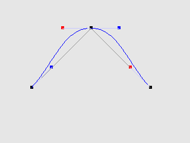
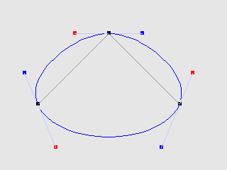
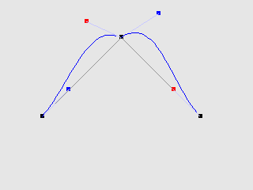

# dr_bcurve
## A Bézier curve drawing, manipulation and traversing tool for DragonRuby


### Creating a curve :
A Bézier curve is an instance of the `Bezier::Curve` class. You can initialize it with with an array of points (called anchors in dr_bcurve terminology). An empty array works too.

```ruby
curve = Bezier::Curve.new [ [200, 200],   # first anchor
                            [300, 300] ]  # second anchor
```


### Adding a point to a curve :
You can dinamically add points to curves.

```ruby
curve << [400, 200] # a third point
```


### Closing and opening a curve :
You can close and open and curve. A newly instantiated curve is always open.

```ruby
curve.close
curve.is_open?    # => false
curve.is_closed?  # => true
```


```ruby
curve.open
curve.is_open?    # => true
curve.is_closed?  # => false
```


### Controls :
Upon instantiation of a new curve, adding a point or closing a curve, controls (red and blue squares on the picture) are created to manipulate the curve around each anchor (black squares). When created, those controls are automatically set to a  somewhat standard balanced position. You can manipulate those controls to reshape the curve.

```ruby
# Get controls for anchor 1:
control_before  = curve.get_control_before 1
control_after   = curve.get_control_after  1
```
or
```ruby
# Get controls for anchor 1:
control_before, control_after = curve.get_controls_at 1
```
Controls can then be moved around like so:
```ruby
# Move controls:
control_before[0] = 260
control_before[1] = 320
control_after[0]  = 340
control_after[1]  = 330
```



CAUTION: controls are returned by reference! Assigning directly a new array to a variable that was previously assigned a control WILL NOT update the curve!

```ruby
# Getting a control:
control = get_control_before 1

# Modifying the control:
# Good:
control[0]  = new_x_value
control[1]  = new_y_value

# Bad:
control = [new_x_value, new_y_value]  # WILL NOT UPDATE THE CURVE
```

### Balance :
You can rebalance the control points for an anchor.

```ruby
curve.balance 1  # balancing anchor 1
```
will bring you back to:\


### Traversing a curve :
You can linearly traverse a curve. Traversing requires the curve to be split in smaller parts. For curves that roughly fit a 1280x720 screen, spliting each section in 25 is a good value.

```ruby
curve.prepare_traversing 25
first   = curve.at(0.0) # a point at the very beginning of the curve
middle  = curve.at(0.5) # a point at the middle of the curve
last    = curve.at(1.0) # a point at the very end of the curve
```
